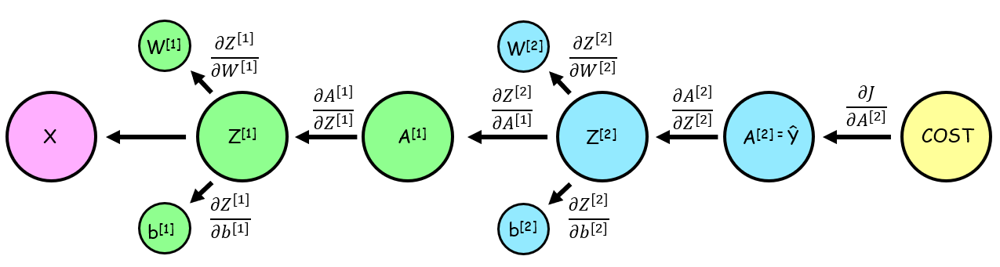
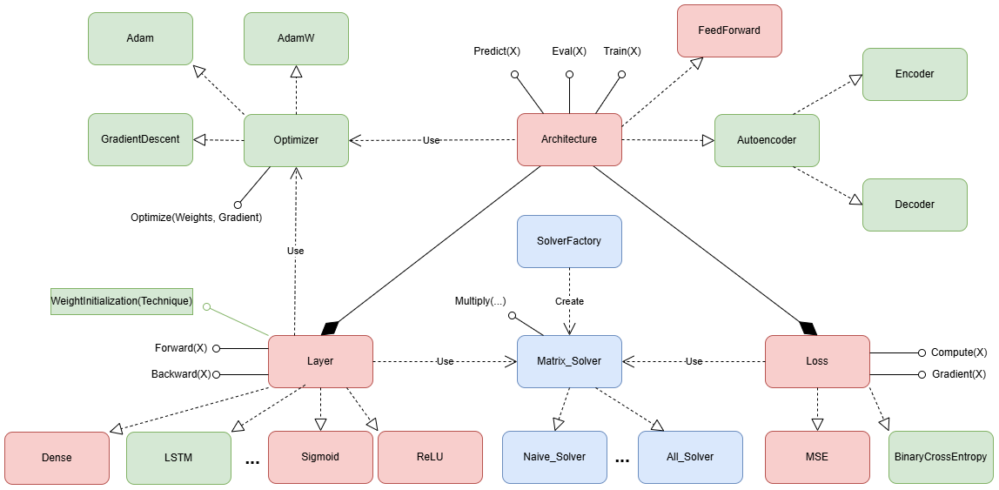
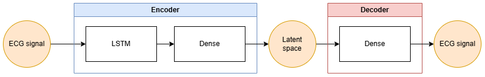
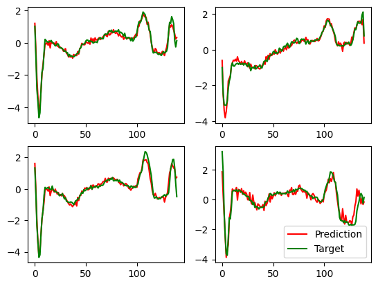
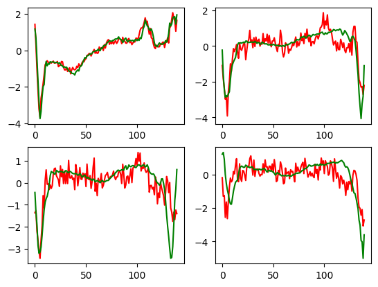

# NeuralNets

## Project Goal

### Hands-on

The **main objective** of this project is to implement and benchmark highly **efficient and parallel Matrix Multiplication** routines from scratch using modern C++.\
The **Feed-Forward Neural Network (FFNN)** serves as the critical application platform where the performance and scalability of these custom solvers are rigorously tested during the training and inference processes.

### Project extension
The objective for the extension of the project is to implement components for a **neural network** library. The library is then used to implement an **autoencoder** and use it to perform **anomaly detection** on an ECG dataset to classify normal and abnormal signals.

## How to Run the Code

### Prerequisites

* C++ compiler
* OpenMP
* pthread
* AVX/AVX2/FMA
* Optional: python (Pandas) for preprocessing

### Build and Run Instructions (for the project extension)
1. Download the dataset, move it to the *dataset* folder and unzip it \
https://www.timeseriesclassification.com/description.php?Dataset=ECG5000

2. Run the preprocessor in the *dataset* folder to obtain processed data 
```bash
python dataset2/preprocessor.py
```

#### To run the program
1. Compile
```bash
g++ src/main.cpp -mavx -mfma -mavx2 -fopenmp -lpthread -o main
```

2. Run
```bash
./main
```

## Mathematical formulation

Training Feed-Forward Neural Networks typically involves [backpropagation](http://en.wikipedia.org/wiki/Backpropagation), which applies the [chain rule](https://en.wikipedia.org/wiki/Chain_rule) to compute gradients layer-by-layer, followed by [gradient descent](https://en.wikipedia.org/wiki/Gradient_descent) to update the network parameters.



## Architecture

The software architecture translates the mathematical formulation into a modular design. It separates the **neural network** components from the **matrix solver** responsible for matrix products. It also ensure extensibility through abstract base classes for all major components: Architecture, Layer, Loss, Optimizer and Matrix_Solver.
- Red components are **neural network** components for the hands-on
- Blue components are **matrix multiplication** components for the hands-on
- Green components are **neural network** components for the extension



## File structure

Mirroring the **architecture**, the file structure is also designed to separate the **neural network** from the **matrix solver** implementations.

**Note: Each folder in the include/NeuralNetwork section contains its own `README.md` with a detailed explanation of its contents.**

```
NeuralNets
|-- dataset2
|  |-- preprocess.py
|  \-- dataset .csv files
|-- include
|  |-- NeuralNetwork
|  |  |-- Architecture
|  |  |  |-- Architecture.hpp
|  |  |  |-- Autoencoder.hpp
|  |  |  |-- Encoder.hpp
|  |  |  |-- Decoder.hpp
|  |  |  \-- FeedForward.hpp
|  |  |-- DataLoader
|  |  |  \-- DataLoader.hpp
|  |  |-- Layer
|  |  |  |-- Layer.hpp
|  |  |  |-- Dense.hpp
|  |  |  |-- ReLu.hpp
|  |  |  |-- CNN1D.hpp
|  |  |  |-- LSTM.hpp
|  |  |  |-- MaxPooling1D.hpp
|  |  |  |-- WeightInitialization.hpp
|  |  |  |-- Softmax.hpp
|  |  |  \-- Sigmoid.hpp
|  |  |-- Loss
|  |  |  |-- Loss.hpp
|  |  |  |-- CrossEntropy.hpp
|  |  |  \-- MSE.hpp
|  |  |-- Optimizer
|  |  |  |-- Optimizer.hpp
|  |  |  |-- GradientDescent.hpp
|  |  |  |-- Adam.hpp
|  |  |  |-- AdamW.hpp
|  |  \-- Matrix.hpp
|  |-- repo_mtx
|  |  \-- Report folders
|  |-- solvers
|  |  \-- Solver .hpp implementations
|  |-- utilities
|  |-- factory_m.hpp
|  \--matrix_solver.hpp
\-- src
   \-- main.cpp
```

## Neural Network Architecture

Using the tools developed above we implemented an **autoencoder**.\
It is composed by:
- Encoder: an **LSTM** followed by a **Dense** layer. We used the **sliding window** technique to pass pieces of the input signal to the LSTM. After processing the whole signal with the LSTM the last hidden state is passed to the Dense layer to reshape the vector to the size of the bottleneck.
- Decoder: a **Dense** layer. It reconstructs the input signal based on the compressed representation.



## Reconstruction results
Because of the small size of the dataset, the similarity of the **normal** signals and the single feature considered, the **autoencoder** quickly reaches a small loss (**MSE**) of under 10 in 3-5 iterations. If the training is performed for more epochs it can reach a training loss of under 3, but risks **overfitting** on the training data and fails to also reconstruct the validation data of the same class.

The following plots are the results of a model with a loss of: **4.59**



## Classification results
The model can be used for **anomaly detection** because, having being trained only on a specific class (**normal**), it has not learned to reconstruct different kinds of **abnormal** classes. The previous model achieved an **F1 score** of **0.92** by classifing as anomalies values above **15MSE**. This shows it's ability to distinguish the different classes.

In the following plot, the top-left reconstruction belongs to a **normal** signal, while the other three belong to **anomalies**. It can be clearly seen the **anomalies** have a greatly more noisy reconstruction.

